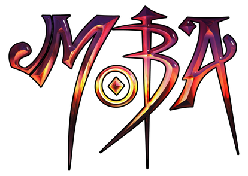

<!-- 
** Thanks for checking out my readme file. If you think adding any more to this readme will make the readme more good then please do make a suggestion.

** Simply open an issue with the tag "enhancement" and say what I need to add or change.

** Don't forget to give the project a star!

** Thanks again! now make something AMAZING! :D
 -->
[![MIT License][license-shield]][license-url]
[![LinkedIn][linkedin-shield]][linkedin-url]

<!-- PROJECT LOGO -->
 

  

  <h3 align="center">Awesome MOBA website</h3>

  

    An awesome MOBA website with many MOBA games listed.
     
    <a href="https://github.com/PriyoRaven/MOBA"><strong>Explore the files »</strong></a>
     
     
    <a href="https://moba-priyo-raven.netlify.app/">View Demo</a>
    ·
    <a href="https://github.com/PriyoRaven/MOBA/issues">Report Bug</a>
    ·
    <a href="https://github.com/PriyoRaven/MOBA/issues">Request Feature</a>
  

<!-- TABLE OF CONTENTS -->

  
Table of Contents

  <ol>
    <li>
      <a href="#about-the-project">About The Project</a>
      <ul>
        <li><a href="#built-with">Built With</a></li>
      </ul>
   </li>
    <li><a href="#usage">Usage</a></li>
    <li><a href="#license">License</a></li>
    <li><a href="#contact">Contact</a></li>
    <li><a href="#acknowledgments">Acknowledgments</a></li>
  </ol>

<!-- ABOUT THE PROJECT -->
## About The Project

[![Product Name Screen Shot][product-screenshot]](https://example.com)

There are many great websites on internet but was missing this awesome MOBA website. So, I created this MOBA games website for fun and also to learn many things. This website features links to many other famous MOBA games website out there.

Here I have added the glassmorphism effect, parallax effect, signup/signin overlay function, star.js function, and carousel features too. Hope this is it but if anymore feature you think will be good then please do suggest.😊

Of course, no website will serve every aspect since needs may be different from others. So I may be adding more in the near future. You may also suggest changes by opening an issue.

(<a href="#readme-top">back to top</a>)

### Built With

This section should list any major frameworks/libraries used to bootstrap your project. Leave any add-ons/plugins for the acknowledgments section. Here are a few examples.

* 
* 
* <a href="https://developer.mozilla.org/en-US/docs/Web/JavaScript" target="_blank"> 

(<a href="#readme-top">back to top</a>)

<!-- USAGE EXAMPLES -->
## Usage

This project can be used as a template to make other projects or to understand some features of CSS to implement more things for others.
 
This project has many more possibilities but all are not implemented here so make one and improve it more. And always you can come and play MOBA games cause they are also a good game genre.

(<a href="#readme-top">back to top</a>)

 
<!-- LICENSE -->
## License

Distributed under the MIT License. See `LICENSE` for more information.

(<a href="#readme-top">back to top</a>)

 
<!-- CONTACT -->
## Contact

- priyadarsi02@gmail.com

Project Link: [https://github.com/PriyoRaven/MOBA](https://github.com/PriyoRaven/MOBA)

(<a href="#readme-top">back to top</a>)

 
 <!-- ACKNOWLEDGMENTS -->
## Acknowledgments

Thanks to all this websites for the completion of my project

* [Choose an Open Source License](https://choosealicense.com)
* [GitHub Emoji Cheat Sheet](https://www.webpagefx.com/tools/emoji-cheat-sheet)
* [Netlify](https://www.netlify.com/)
* [Img Shields](https://shields.io)
* [GitHub Pages](https://pages.github.com)
* [Font Awesome](https://fontawesome.com)
* [Youtube](https://www.netlify.com/)
* [Codepen](https://codepen.io/)
 
And also special thanks to 

* <a href="https://github.com/souvik-wizard">Souvik-wizard</a>
* <a href="https://github.com/ArnabDas2001">Arnab Das</a>
* <a href="https://github.com/TuhinBar">Tuhin Bar</a>
* <a href="https://github.com/arian0zen">Arian0zen</a>
* <a href="https://github.com/Apurba-Sardar">Apurba Sardar</a>
 
 Without all help this project would not have been completed.
 

(<a href="#readme-top">back to top</a>)

 
<!-- ** Mark down links and URLS -->
[license-shield]: https://img.shields.io/github/license/PriyoRaven/MOBA.svg?style=for-the-badge
[license-url]: https://github.com/PriyoRaven/MOBA/blob/master/LICENSE.txt
[stars-shield]: https://img.shields.io/github/stars/PriyoRaven/MOBA.svg?style=for-the-badge
[stars-url]: https://github.com/PriyoRaven/MOBA/stargazers
[linkedin-shield]: https://img.shields.io/badge/-LinkedIn-black.svg?style=for-the-badge&logo=linkedin&colorB=555
[linkedin-url]: https://www.linkedin.com/in/priyadarsi-halder-786a8a237/
[product-screenshot]: assets/gallery/screenshot.jpeg
