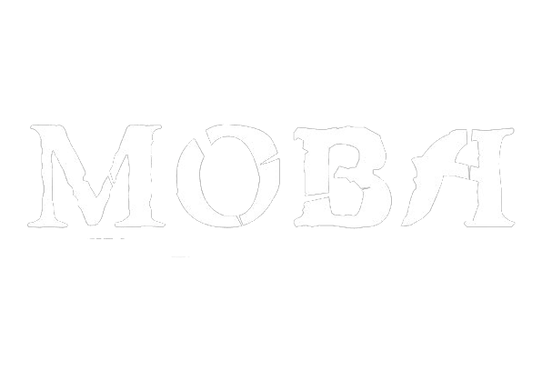

<!-- 
** Thanks for checking out my readme file. If you think adding anymore to this readme will make the readme more good then please do make suggestion.

** simply open an issue with the tag "enhancement" and say what i need to add or change.

** Don't forget to give the project a star!

** Thanks again! now make something AMAZING! :D
 -->
[![MIT License][license-shield]][license-url]
[![Stargazers][stars-shield]][stars-url]
[![LinkedIn][linkedin-shield]][linkedin-url]

<!-- PROJECT LOGO -->
 

  

  <h3 align="center">Awesome MOBA website</h3>

  

    An awesome MOBA website with many MOBA games listed.
     
    <a href="https://github.com/PriyoRaven/MOBA"><strong>Explore the files »</strong></a>
     
     
    <a href="https://moba-priyo-raven.netlify.app/">View Demo</a>
    ·
    <a href="https://github.com/PriyoRaven/MOBA/issues">Report Bug</a>
    ·
    <a href="https://github.com/PriyoRaven/MOBA/issues">Request Feature</a>
  

<!-- TABLE OF CONTENTS -->

  
Table of Contents

  <ol>
    <li>
      <a href="#about-the-project">About The Project</a>
      <ul>
        <li><a href="#built-with">Built With</a></li>
      </ul>
    </li>
    <li>
      <a href="#getting-started">Getting Started</a>
      <ul>
        <li><a href="#prerequisites">Prerequisites</a></li>
        <li><a href="#installation">Installation</a></li>
      </ul>
    </li>
    <li><a href="#usage">Usage</a></li>
    <li><a href="#roadmap">Roadmap</a></li>
    <li><a href="#contributing">Contributing</a></li>
    <li><a href="#license">License</a></li>
    <li><a href="#contact">Contact</a></li>
    <li><a href="#acknowledgments">Acknowledgments</a></li>
  </ol>

<!-- ** Mark down links and URLS -->
[license-shield]: https://img.shields.io/github/license/PriyoRaven/MOBA.svg?style=for-the-badge
[license-url]: https://github.com/PriyoRaven/MOBA/blob/master/LICENSE.txt
[stars-shield]: https://img.shields.io/github/stars/PriyoRaven/MOBA.svg?style=for-the-badge
[stars-url]: https://github.com/PriyoRaven/MOBA/stargazers
[linkedin-shield]: https://img.shields.io/badge/-LinkedIn-black.svg?style=for-the-badge&logo=linkedin&colorB=555
[linkedin-url]: https://www.linkedin.com/in/priyadarsi-halder-786a8a237/
